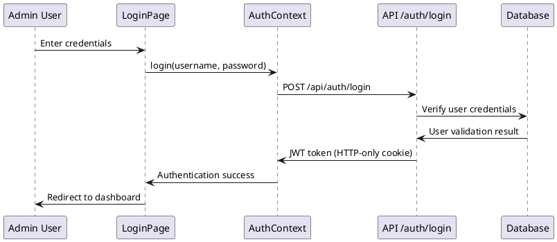
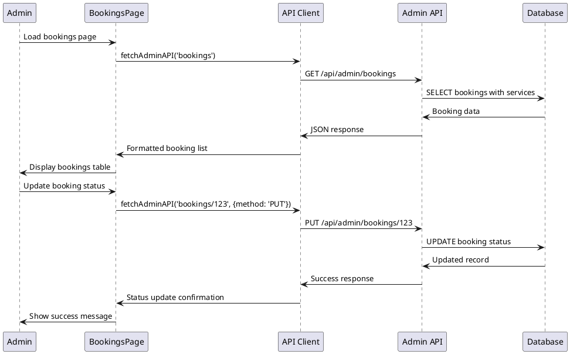

# Dubai Rose Admin Dashboard Architecture

## Overview

This document provides a comprehensive analysis of the Dubai Rose admin
dashboard architecture, including system design, implementation patterns, and
quality assessment.

## System Architecture

### High-Level Architecture

The Dubai Rose admin dashboard follows a modern web application architecture
with the following key components:

- **Frontend**: React/TypeScript with Vite build system
- **Backend**: Express.js server with Vercel serverless functions
- **Database**: PostgreSQL with Drizzle ORM
- **Authentication**: Custom JWT-based system with HTTP-only cookies
- **UI Framework**: Shadcn UI components with Tailwind CSS

### Deployment Strategy

The application uses a dual-deployment strategy:

- **Development**: Express server for local development
- **Production**: Vercel serverless functions for scalability

## Architecture Diagrams

### C4 Model: System Context Diagram

```plantuml
@startuml Dubai Rose System Context
!include https://raw.githubusercontent.com/plantuml-stdlib/C4-PlantUML/master/C4_Context.puml

title Dubai Rose Beauty Center - System Context Diagram

Person(admin, "Admin User", "Beauty center administrator managing appointments and services")
Person(customer, "Customer", "Clients booking beauty treatments")

System_Boundary(dubairose, "Dubai Rose System") {
    System(webapp, "Dubai Rose Web Application", "React frontend with admin dashboard for managing bookings, services, and availability")
}

System_Ext(database, "PostgreSQL Database", "Stores all application data including bookings, services, users")
System_Ext(vercel, "Vercel Platform", "Hosts the application and provides serverless backend")
System_Ext(clerk, "Clerk Auth", "Authentication service (configured but not actively used)")

admin --> webapp : "Manages appointments,\nservices, availability"
customer --> webapp : "Books appointments,\nviews services"
webapp --> database : "CRUD operations"
webapp --> vercel : "Deployed on"
webapp ..> clerk : "Auth configured\n(not actively used)"

@enduml
```

### C4 Model: Container Diagram

```plantuml
@startuml Dubai Rose Container Diagram
!include https://raw.githubusercontent.com/plantuml-stdlib/C4-PlantUML/master/C4_Container.puml

title Dubai Rose Beauty Center - Container Diagram

Person(admin, "Admin User")
Person(customer, "Customer")

System_Boundary(dubairose, "Dubai Rose System") {
    Container(webapp, "React Web Application", "TypeScript, React, Vite", "Provides admin dashboard and customer booking interface")

    Container_Boundary(backend, "Backend Services") {
        Container(express, "Express Server", "Node.js, Express", "Development server for local environment")
        Container(vercel_api, "Vercel API Functions", "Serverless Functions", "Production API endpoints")
    }

    Container(auth, "Authentication Module", "JWT, HTTP-only Cookies", "Handles admin authentication and session management")
}

ContainerDb(database, "PostgreSQL Database", "Drizzle ORM", "Stores bookings, services, users, blocked slots")

admin --> webapp : "Uses admin dashboard"
customer --> webapp : "Books appointments"

webapp --> express : "API calls (development)"
webapp --> vercel_api : "API calls (production)"
webapp --> auth : "Authentication requests"

express --> database : "Database queries"
vercel_api --> database : "Database queries"
auth --> database : "User verification"

@enduml
```

### C4 Model: Component Diagram - Admin Dashboard

```plantuml
@startuml Admin Dashboard Components
!include https://raw.githubusercontent.com/plantuml-stdlib/C4-PlantUML/master/C4_Component.puml

title Admin Dashboard - Component Diagram

Container(webapp, "React Web Application")

Container_Boundary(admin_ui, "Admin Dashboard UI") {
    Component(admin_layout, "AdminLayout", "React Component", "Main layout with sidebar navigation and user context")
    Component(dashboard_page, "DashboardPage", "React Component", "Shows summary statistics and metrics")
    Component(bookings_page, "BookingsPage", "React Component", "Manages appointment bookings with CRUD operations")
    Component(booking_detail, "BookingDetailPage", "React Component", "Individual booking management")
    Component(services_page, "ServicesPage", "React Component", "Service catalog management")
    Component(availability_page, "AvailabilityPage", "React Component", "Time slot blocking and availability management")
    Component(users_page, "UsersPage", "React Component", "User account management")
    Component(profile_page, "ProfilePage", "React Component", "Admin profile management")
}

Container_Boundary(auth_components, "Authentication Components") {
    Component(protected_route, "ProtectedRoute", "React Component", "Route protection wrapper")
    Component(auth_context, "AuthContext", "React Context", "Global authentication state management")
    Component(login_page, "LoginPage", "React Component", "Admin login interface")
}

Container_Boundary(ui_components, "Shared UI Components") {
    Component(shadcn_ui, "Shadcn UI Components", "React Components", "Reusable UI components (Table, Card, Button, etc.)")
    Component(forms, "Form Components", "React Components", "Dialog forms for CRUD operations")
}

Container_Boundary(api_layer, "API Layer") {
    Component(api_client, "API Client", "TypeScript Module", "Centralized API communication with error handling")
    Component(admin_api, "Admin API Helper", "TypeScript Module", "Specialized admin endpoint communication")
}

admin_layout --> dashboard_page
admin_layout --> bookings_page
admin_layout --> services_page
admin_layout --> availability_page
admin_layout --> users_page
admin_layout --> profile_page

bookings_page --> booking_detail

protected_route --> auth_context
admin_layout --> auth_context
login_page --> auth_context

dashboard_page --> shadcn_ui
bookings_page --> shadcn_ui
services_page --> shadcn_ui
users_page --> forms

bookings_page --> api_client
services_page --> admin_api
dashboard_page --> admin_api

@enduml
```

### C4 Model: Backend API Architecture

```plantuml
@startuml Backend API Architecture
!include https://raw.githubusercontent.com/plantuml-stdlib/C4-PlantUML/master/C4_Component.puml

title Backend API - Component Diagram

Container_Boundary(express_server, "Express Server (Development)") {
    Component(server_main, "Server Main", "Express App", "Main application setup with middleware")
    Component(admin_routes, "Admin Routes", "Express Router", "Protected admin endpoints")
    Component(auth_routes, "Auth Routes", "Express Router", "Authentication endpoints")
    Component(public_routes, "Public Routes", "Express Router", "Customer-facing endpoints")
    Component(profile_routes, "Profile Routes", "Express Router", "Admin profile management")
    Component(user_mgmt, "User Management", "Express Router", "User CRUD operations")
}

Container_Boundary(vercel_functions, "Vercel Serverless Functions") {
    Component(admin_api, "Admin API Function", "Serverless Function", "Consolidated admin operations")
    Component(auth_api, "Auth API Function", "Serverless Function", "Authentication handling")
    Component(services_api, "Services API Function", "Serverless Function", "Service catalog operations")
    Component(bookings_api, "Bookings API Function", "Serverless Function", "Booking operations")
}

Container_Boundary(middleware, "Middleware Layer") {
    Component(auth_middleware, "Auth Middleware", "JWT Verification", "Protects admin routes")
    Component(cors_middleware, "CORS Middleware", "Cross-Origin", "Handles CORS for production")
    Component(error_handler, "Error Handler", "Express Middleware", "Centralized error handling")
}

Container_Boundary(data_layer, "Data Access Layer") {
    Component(drizzle_orm, "Drizzle ORM", "TypeScript ORM", "Database abstraction layer")
    Component(storage_interface, "Storage Interface", "TypeScript Module", "Business logic for data operations")
    Component(schema, "Database Schema", "Drizzle Schema", "Type-safe database schema definitions")
}

ContainerDb(postgres, "PostgreSQL Database")

server_main --> admin_routes
server_main --> auth_routes
server_main --> public_routes
server_main --> profile_routes
server_main --> user_mgmt

admin_routes --> auth_middleware
profile_routes --> auth_middleware
user_mgmt --> auth_middleware

admin_api --> auth_middleware
auth_api --> cors_middleware

admin_routes --> storage_interface
admin_api --> drizzle_orm
storage_interface --> drizzle_orm
drizzle_orm --> schema
drizzle_orm --> postgres

@enduml
```

## Implementation Analysis

### Authentication Architecture

The authentication system uses a custom JWT-based approach with the following
characteristics:

**Strengths:**

- HTTP-only cookies for security
- Database-backed user verification
- Admin role checking
- Proper token expiration

**Current Implementation:**

```typescript
// JWT token generation with database user verification
const token = jwt.sign({ userId: userResults[0].id.toString() }, JWT_SECRET, {
  expiresIn: JWT_EXPIRES_IN,
});

// Secure cookie settings
const cookieOptions = {
  httpOnly: true,
  secure: process.env.NODE_ENV === 'production',
  sameSite: 'strict' as const,
  maxAge: 24 * 60 * 60 * 1000, // 24 hours
  path: '/',
};
```

### Database Design

The system uses a well-structured PostgreSQL schema with Drizzle ORM:

**Core Tables:**

- `users` - Admin accounts with role-based access
- `bookings` - Customer appointments with status tracking
- `services` - Service catalog with multilingual support
- `service_groups` - Service categorization
- `blocked_time_slots` - Availability management
- `memberships` - VIP membership system
- `contacts` - Customer inquiries

### API Architecture

**Dual Environment Strategy:**

- **Development**: Express server with traditional REST routes
- **Production**: Vercel serverless functions with consolidated endpoints

**API Endpoint Structure:**

```
/api/admin/dashboard-summary  - Dashboard metrics
/api/admin/bookings          - Booking management
/api/admin/services          - Service management
/api/admin/blocked-slots     - Availability management
/api/admin/users             - User management
/api/admin/profile           - Admin profile
/api/auth/login             - Authentication
/api/auth/logout            - Session termination
/api/auth/me                - User info retrieval
```

### Frontend Architecture

**Component Hierarchy:**

```
App
├── AuthProvider (Context)
├── Router
    ├── Public Routes
    │   ├── Home
    │   ├── ServiceDetails
    │   └── LoginPage
    └── Protected Routes (AdminLayout)
        ├── DashboardPage
        ├── BookingsPage
        │   └── BookingDetailPage
        ├── ServicesPage
        ├── AvailabilityPage
        ├── UsersPage
        └── ProfilePage
```

**State Management:**

- React Context for authentication state
- Local component state for UI interactions
- API-driven data fetching with error handling

## Data Flow Analysis

### Authentication Flow



### Booking Management Flow



## Technology Stack Details

### Frontend Technologies

| Technology   | Version | Purpose                              |
| ------------ | ------- | ------------------------------------ |
| React        | 18.x    | Core UI framework                    |
| TypeScript   | 5.x     | Type safety and developer experience |
| Vite         | 5.x     | Build tool and development server    |
| Tailwind CSS | 3.x     | Utility-first styling                |
| Shadcn UI    | Latest  | Pre-built component library          |
| React Router | 6.x     | Client-side routing                  |
| Sonner       | Latest  | Toast notifications                  |
| Lucide React | Latest  | Icon library                         |

### Backend Technologies

| Technology  | Version | Purpose               |
| ----------- | ------- | --------------------- |
| Node.js     | 18.x    | Runtime environment   |
| Express.js  | 4.x     | Web framework         |
| TypeScript  | 5.x     | Type safety           |
| Drizzle ORM | Latest  | Database ORM          |
| PostgreSQL  | 15.x    | Primary database      |
| JWT         | Latest  | Authentication tokens |
| bcryptjs    | Latest  | Password hashing      |
| Multer      | Latest  | File upload handling  |

### Development & Deployment

| Technology  | Purpose                     |
| ----------- | --------------------------- |
| Vercel      | Production hosting platform |
| Neon        | PostgreSQL database hosting |
| ESLint      | Code linting                |
| Prettier    | Code formatting             |
| Drizzle Kit | Database migrations         |

## Security Implementation

### Authentication Security

1. **JWT Token Management:**

   - HTTP-only cookies prevent XSS attacks
   - Secure flag for HTTPS-only transmission
   - SameSite=strict prevents CSRF attacks
   - 24-hour expiration limits exposure

2. **Password Security:**

   - bcrypt hashing with salt rounds
   - Database-stored hashed passwords
   - No plaintext password storage

3. **API Security:**
   - Authentication middleware on all admin routes
   - Database-backed user verification
   - Admin role checking

### Data Protection

1. **Database Security:**

   - Environment variable configuration
   - Prepared statements via ORM
   - Input validation and sanitization

2. **CORS Configuration:**
   - Origin whitelist for production
   - Credentials support for authenticated requests
   - Preflight request handling

## Performance Considerations

### Database Optimization

1. **Query Optimization:**

   - Indexed primary keys and foreign keys
   - Efficient JOIN operations for booking-service relationships
   - Limit clauses for pagination

2. **Connection Management:**
   - Connection pooling for Express server
   - Serverless-optimized connections for Vercel

### Frontend Performance

1. **Code Splitting:**

   - Route-based code splitting
   - Dynamic imports for admin components
   - Lazy loading of heavy components

2. **Caching Strategy:**
   - Browser caching for static assets
   - API response caching where appropriate
   - Service worker for offline capability (future enhancement)

## Quality Assessment Summary

### Strengths

1. **Architecture:**

   - Clean separation of concerns
   - Type safety throughout the stack
   - Modern React patterns and hooks
   - Consistent component structure

2. **Development Experience:**

   - Comprehensive TypeScript coverage
   - Shadcn UI for consistent design
   - Hot reload in development
   - Clear project structure

3. **Security:**
   - Proper authentication implementation
   - Secure cookie handling
   - Database-backed user management
   - CORS configuration

### Areas for Improvement

See the comprehensive bug report and quality issues document for detailed
analysis of improvements needed.

## Future Enhancements

1. **Performance Optimization:**

   - Implement proper caching strategies
   - Add database indexing
   - Optimize bundle size

2. **Feature Completions:**

   - Real-time notifications
   - Advanced filtering and search
   - Export functionality
   - Audit logging

3. **Infrastructure:**

   - Monitoring and logging
   - Automated testing
   - CI/CD pipeline
   - Error tracking

4. **User Experience:**
   - Mobile responsiveness
   - Accessibility improvements
   - Progressive Web App features
   - Offline functionality

---

_This document serves as a comprehensive architectural overview of the Dubai
Rose admin dashboard system. For specific implementation details, refer to the
source code and additional documentation._
